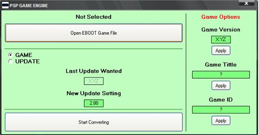



## PSP Game Engine

### Description

Run any game demo on any system version, Edit photo, Edit game title, then recompile data to new .PBP file.

Use it for Games demos &amp; Update files.

Get it now and vote for me please..
 
### More Info
 

             |
---                |---
**Submitted On**   |2007-08-29 15:29:20
**By**             |[Zaid Markabi](https://github.com/Planet-Source-Code/PSCIndex/blob/master/ByAuthor/zaid-markabi.md)
**Level**          |Advanced
**User Rating**    |3.8 (15 globes from 4 users)
**Compatibility**  |VB 5\.0, VB 6\.0
**Category**       |[Complete Applications](https://github.com/Planet-Source-Code/PSCIndex/blob/master/ByCategory/complete-applications__1-27.md)
**World**          |[Visual Basic](https://github.com/Planet-Source-Code/PSCIndex/blob/master/ByWorld/visual-basic.md)
**Archive File**   |[PSP\_Game\_E2128359262008\.zip](https://github.com/Planet-Source-Code/zaid-markabi-psp-game-engine__1-71131/archive/master.zip)

